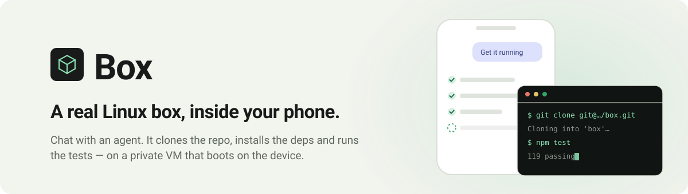
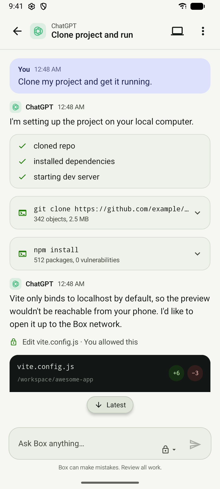
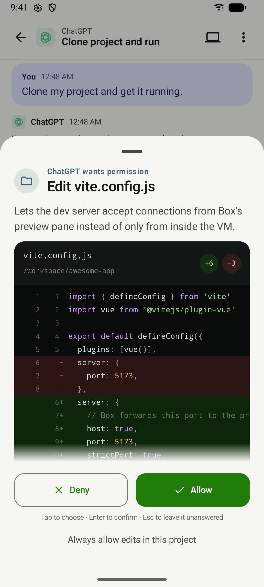
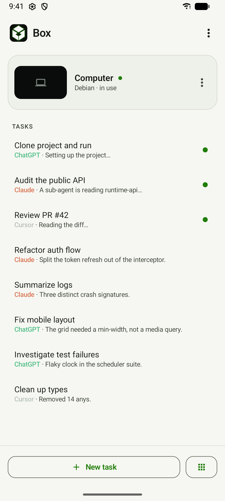
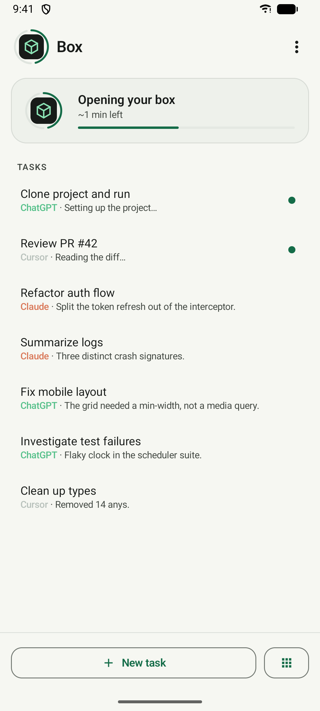
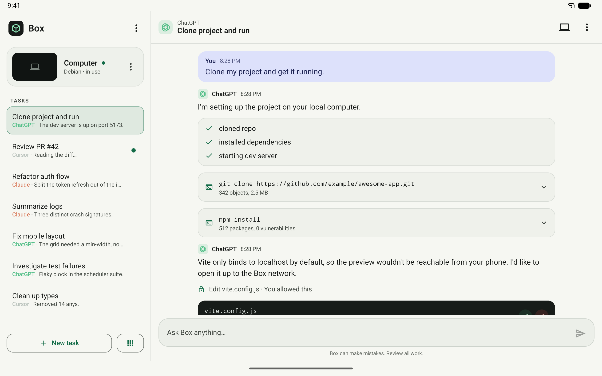
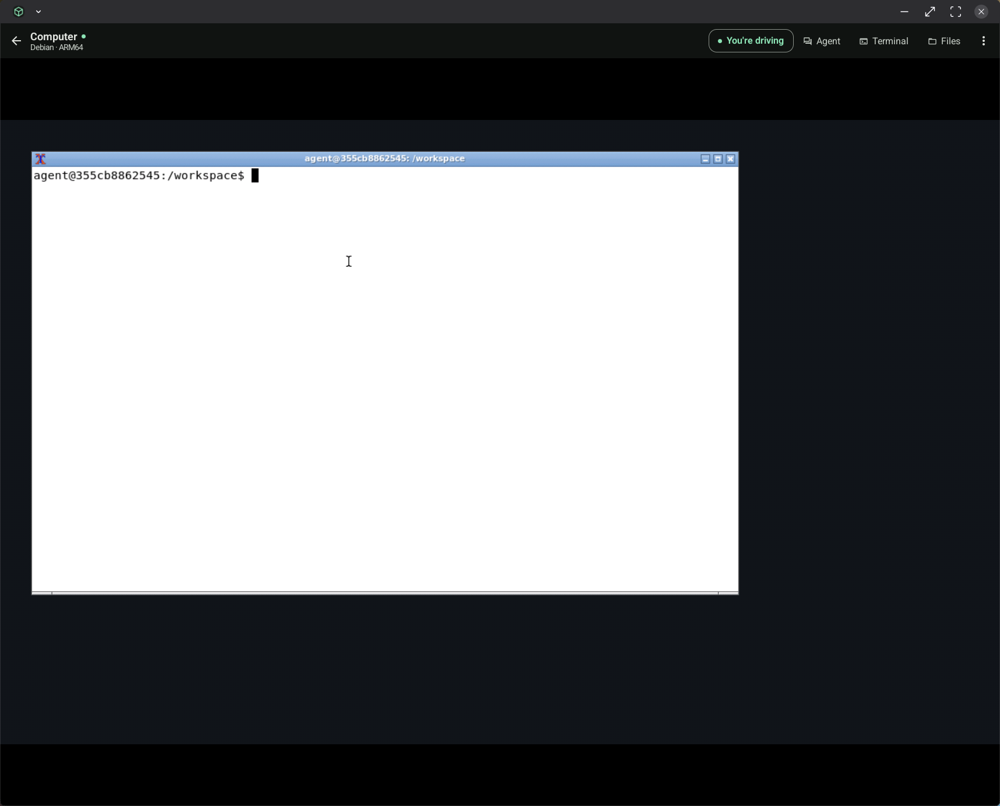
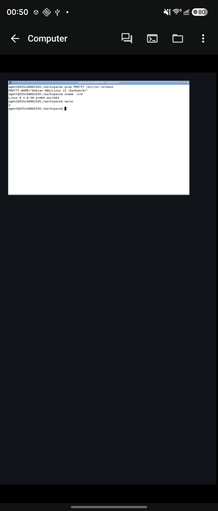
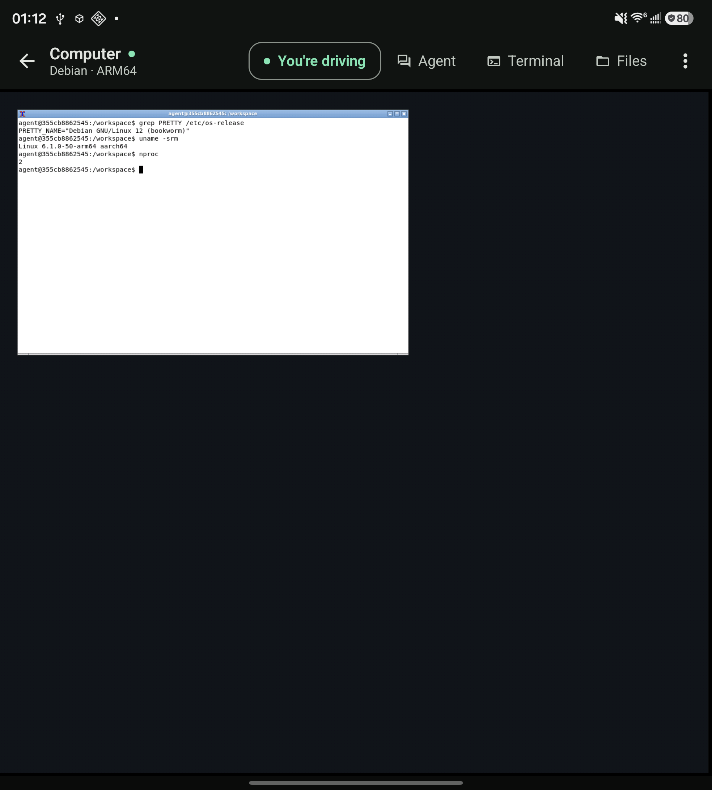

<p align="center">
  <picture>
    <source media="(prefers-color-scheme: dark)" srcset="docs/assets/hero-dark.svg">
    
  </picture>
</p>

<p align="center">
  <strong>Box is an AI chat app whose agents have a real computer.</strong><br>
  Not a sandbox rented in the cloud — a Debian VM that boots on the phone in your hand.
</p>

## The whole idea

You say:

> Clone my project and get it running.

Box goes quiet for a moment, then reports back in plain language:

```
✓  Cloned the project
✓  Installed dependencies
✓  Fixed an error
⟳  Starting the app
```

Every line is something that actually happened on a machine. The agent didn't tell you how
to clone the repo — it cloned it, ran the tests, read the failure. The files are still
there tomorrow.

You never see a terminal, and you never need to know it's Linux.

<p align="center">
  <picture>
    <source media="(prefers-color-scheme: dark)" srcset="docs/assets/screenshots/phone-progress-dark.png">
    
  </picture>
  &nbsp;
  <picture>
    <source media="(prefers-color-scheme: dark)" srcset="docs/assets/screenshots/phone-permission-dark.png">
    
  </picture>
</p>

Every card opens if you want the commands. And nothing is edited without the diff being
put in front of you first.

## Until you want to

Tap **Open computer** and there it is: the desktop the agent is working on, live. Tap
**Take over** and the keyboard and mouse are yours — the agent's input is suspended until
you hand it back.

## One box, many agents

The computer belongs to Box, not to any one agent. So one of them builds it, another
reviews it, a third fixes the one thing that's broken — same machine, same files, same
`/workspace` that survives every conversation.

<p align="center">
  <picture>
    <source media="(prefers-color-scheme: dark)" srcset="docs/assets/screenshots/phone-tasks-dark.png">
    
  </picture>
  &nbsp;
  <picture>
    <source media="(prefers-color-scheme: dark)" srcset="docs/assets/screenshots/phone-opening-dark.png">
    
  </picture>
</p>

Opening the box takes a couple of minutes the first time.

## The screen you happen to have

On a phone Box is a chat app, and the computer stays out of the way. On a Fold, a tablet
or Samsung DeX it opens out: conversation on one side, the agent's live desktop on the
other. Plug in a keyboard and you're using a small Linux PC that was in your pocket.

<p align="center">
  <picture>
    <source media="(prefers-color-scheme: dark)" srcset="docs/assets/screenshots/tablet-progress-dark.png">
    
  </picture>
</p>

And this one is not an emulator at all — it is the desktop, on a desk:

<p align="center">
  
</p>

A Galaxy Z Fold 7 in DeX driving a 3440×1440 monitor. The same machine, folded shut and
unfolded:

<p align="center">
  
  &nbsp;&nbsp;
  
</p>

Debian 12 on an ARM64 kernel with two cores, in a phone, its screen resized to fit each
shape rather than letterboxed into it.

## Nothing to set up

Real Linux on Android today means several apps, a tour of the developer settings, and a
command-line walkthrough you'll look up again next week. Box absorbs that whole thing.

Install Box. Open it. Start chatting. No Termux, no separate X11 app, no terminal.

---

## Where this actually is

Nobody should have to guess which of the above already works.

| Promise | Where it stands |
| --- | --- |
| **The computer** | Real. A Debian VM boots under QEMU. Commands run, files persist. |
| **A real agent in it** | Real. Claude Code runs inside the VM, and you sign in through the phone's browser — no API key to paste. The full sign-in round trip isn't proven on hardware yet. |
| **Open computer / Take over** | Real, on hardware. You see the guest's desktop, and taking over moves its cursor and types into its shell. |
| **Other agents** | ChatGPT and Cursor are a scripted demo. Only Claude Code is wired up for real. |
| **Preview a running server** | Real, but not yet confirmed on hardware. |

The honest cost: it's a fully emulated VM, so the first boot takes a couple of minutes on
a Galaxy Z Fold 7.

And the pictures. The phone and tablet ones are emulator screenshots, so the conversation
in them is Box's built-in demo — but every pixel around it is the shipping UI. The three
desktop ones are a real Fold 7 with a real VM behind it, so that Debian is running and the
`uname` output is that machine answering.

## Build it

Onto a plugged-in arm64 phone, in one command. The first run needs `--image`, which builds
the guest image in a container first — a few minutes, and Docker has to be running:

```bash
./tools/deploy.sh --image
```

After that, build, install and launch:

```bash
./tools/deploy.sh
```

Reach for `--image` again whenever anything under `guest/` changed. It reprovisions, which
is the only way a new image reaches a device — an installed Box keeps its guest disk on
purpose, so an app update never wipes the user's Linux box.

The tests, which need no device:

```bash
./gradlew :app:testStockDebugUnitTest :runtime-qemu:testDebugUnitTest && node --test guest/tests/*.mjs && python3 -m unittest discover -s guest/tests
```

Building by hand, watching a boot from `adb logcat`, and why a rebuilt guest image can
appear to do nothing: [docs/development.md](docs/development.md).

## Layout

| Module | What it holds |
| --- | --- |
| `app/` | Compose UI, the semantic event model, the adaptive phone/tablet/DeX layouts |
| `runtime-api/` | The `ComputerRuntime` boundary — exec, streaming exec, PTY, files, sessions |
| `runtime-qemu/` | QEMU AArch64, the out-of-process runtime service, the `agentd` client |
| `guest/` | Image builder, `agentd`, and the agent harness that runs inside the VM |
| `protocol/` | The `agentd` wire protocol — [v2](protocol/agentd-v2.md) is current |
| `docs/` | [Runtime design](docs/runtime.md), [UI contract](docs/ui-contract.md), [development](docs/development.md) |

Two build flavors. `stock` is the product: QEMU, carrying the guest image. `avf` is the
same app without it, so UI work builds on a machine that has never run the guest builder.
The name is a leftover — Android doesn't offer hardware virtualization to third-party
apps, so full emulation is not a stage Box is passing through
([the spike](docs/spike-android-toolchain.md) has the evidence).
