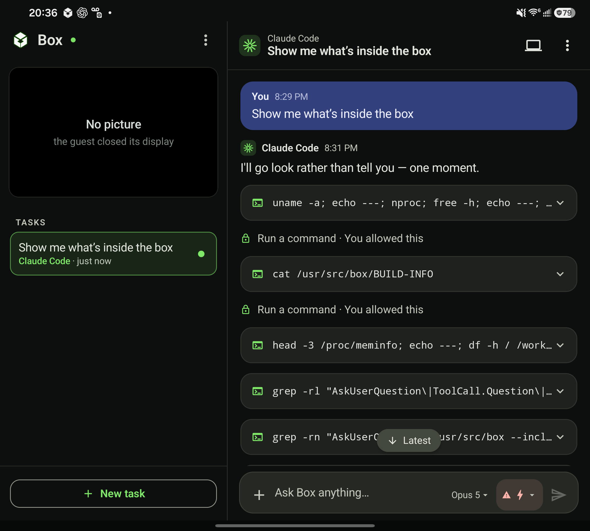
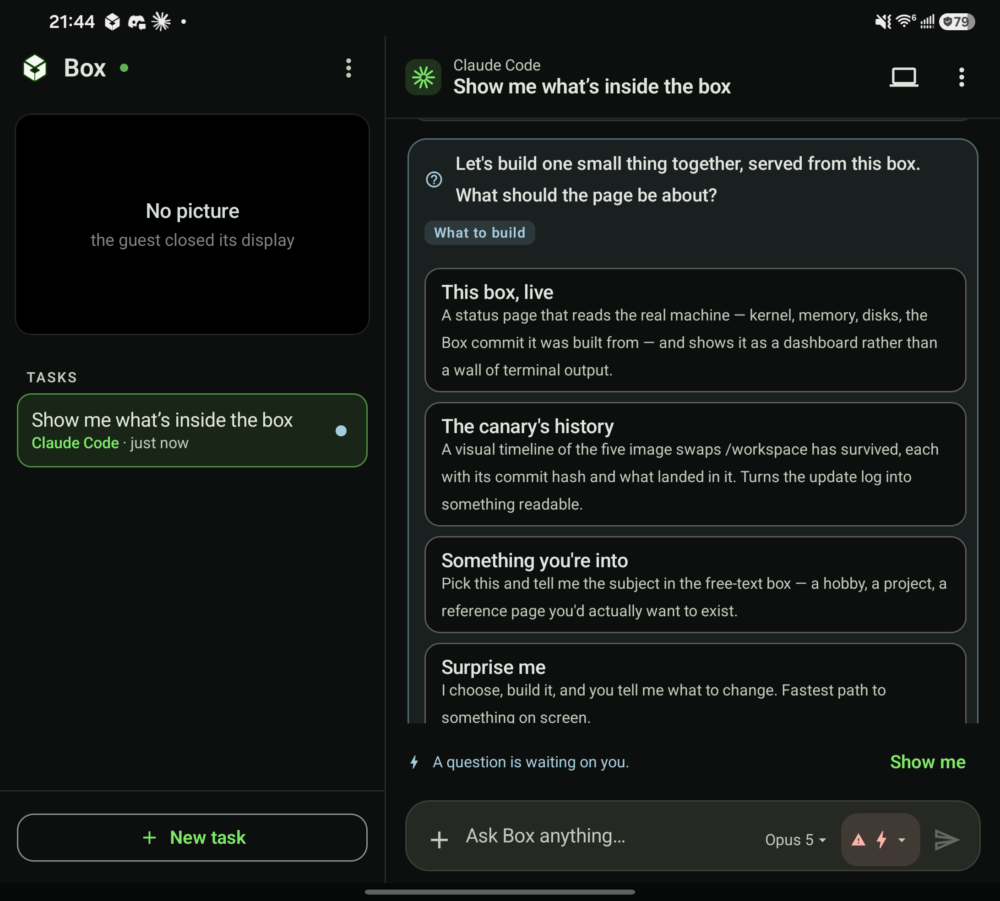

<p align="center">
  <picture>
    <source media="(prefers-color-scheme: dark)" srcset="docs/assets/hero-dark.svg">
    
  </picture>
</p>

<p align="center">
  <strong>A Linux computer that lives on your Android phone.</strong><br>
  Use it yourself, or give tasks to an agent working inside the same machine.
</p>

Box boots a persistent Debian VM directly on your phone.

Open the computer and use it like a normal desktop with a keyboard and mouse. Or start a task and chat with an agent that can use the same machine, files and tools for you.

No cloud VM. The computer is on the device in your hand.

## What Box is for

I built Box around the setup I want when I travel: a Galaxy Z Fold 7, DeX, a portable monitor or display glasses, and a small keyboard and mouse.

Box can sit in one DeX window as a full Linux computer.

<p align="center">
  
</p>

If I don't have another display, I can use the same computer on the Fold's inner screen or even the cover screen.

<p align="center">
  
  &nbsp;&nbsp;
  
</p>

Same box. Same files. Different screen.

## Use it as a computer

With a keyboard and mouse attached, Box behaves like a desktop.

Without them, the screen becomes a trackpad:

- drag to move the pointer
- tap to click
- two-finger tap to right-click
- two-finger drag to scroll
- tap and drag to drag

Box also has its own desktop keyboard for keys that matter in Linux: Ctrl, Alt, Super, Escape, function keys and the rest.

Plug a keyboard or mouse in and use it directly.

## Or give it a task

Tasks are conversations with an agent that has access to the same computer.

The first time Box opens it offers one thing to say — **"Show me what's inside the box"** — and answers it by doing the work: the agent reads the machine it is running on, tells you what it found, asks what you would like it to build, and builds it. Nothing about that reply is scripted. It is the same agent you get afterwards, working for the first time.

Ask it to clone a repo, fix something, run tests, work on a feature, review code, or prepare a PR. It can even work on Box itself.

The useful part is that this is not a disposable remote sandbox. The agent works inside your box, with the same persistent `/workspace` you can open yourself.

You can start something with the agent, open the desktop and inspect it, take over with the mouse and keyboard, then hand it back.

<p align="center">
  
  &nbsp;
  
</p>

Commands, diffs and permission requests stay visible in the conversation. If you want the actual computer, open it.

## What works today

| | Status |
| --- | --- |
| **Computer** | Debian 12 VM running locally under QEMU; commands run and files persist. |
| **Desktop** | Open the guest desktop and take over with keyboard, mouse or touch. |
| **Phone input** | Relative touch trackpad plus Box's own desktop keyboard. |
| **Agent** | Claude Code runs inside the VM with persistent task history. You sign in through the phone's browser — no API key to paste. |
| **Other agents** | ChatGPT and Cursor are currently scripted demos. |
| **Server preview** | Confirmed on hardware. A server the agent starts in the guest is forwarded to the phone and opens in a panel beside the conversation. |
| **Android apps** | Confirmed on hardware. The agent can build a signed, installable APK inside the guest and hand it back — no Gradle, no Android Studio, no laptop. |

The main cost today is performance: the stock runtime is fully emulated ARM64, so the first boot takes a couple of minutes on a Galaxy Z Fold 7.

### The phone builds its own apps

Google ships Android's build tools as x86-64 binaries, so the usual route does not run on an
ARM64 phone. Box assembles a toolchain that does: a community ARM64 `aapt2`, `d8` and
`apksigner` lifted unchanged out of Google's own archive because they are pure Java, and `ecj`
in place of a JDK. Roughly 100 MB, installed into `/workspace` where it survives app updates.

There are two paths, and the fast one is more capable than it sounds:

| | **From scratch** | **With AndroidX** |
| --- | --- | --- |
| Clean build | **~3 min** | ~13 min, cache warm |
| Available API | the whole Android platform | the same, plus Material |
| Needs | nothing | Maven resolution + a dex cache |

Building from scratch is not a stripped-down mode. `android.jar` is the entire platform —
SQLite, Camera2, sensors, notifications, home-screen widgets, `Canvas`, and WebView, which makes
a native shell around local HTML a real option rather than a workaround. What AndroidX adds is
mostly convenience and Material's look, and the boilerplate a library saves is the part an agent
can simply write.

So the agent resolves Maven when an app genuinely needs it and otherwise stays on the fast path.
Details and measurements in [`docs/spike/android-toolchain/gradle-free/`](docs/spike/android-toolchain/gradle-free/).

## Install it

The [latest release](https://github.com/garfbargle/box/releases/latest) has a prebuilt APK:

```bash
adb install -r box-*-stock.apk
```

## Build it

For a plugged-in ARM64 Android phone, build the guest image and app:

```bash
./tools/deploy.sh --image
```

After the guest image exists:

```bash
./tools/deploy.sh
```

Use `--image` again when something under `guest/` changes.

Run the tests with:

```bash
./gradlew :app:testStockDebugUnitTest :runtime-qemu:testDebugUnitTest \
  && node --test guest/tests/*.mjs \
  && python3 -m unittest discover -s guest/tests
```

More development notes are in [docs/development.md](docs/development.md).

## Layout

| Module | What it holds |
| --- | --- |
| `app/` | Compose UI and adaptive phone/Fold/DeX layouts |
| `runtime-api/` | Runtime interface: exec, PTY, files and sessions |
| `runtime-qemu/` | QEMU runtime and `agentd` client |
| `guest/` | Debian image, `agentd` and agent harnesses |
| `protocol/` | `agentd` wire protocol |
| `docs/` | Runtime, UI and development documentation |

`stock` is the product build and carries the QEMU guest image. The `avf` flavor is kept for app/UI work without bundling the guest image; Android does not expose hardware virtualization to third-party apps.
