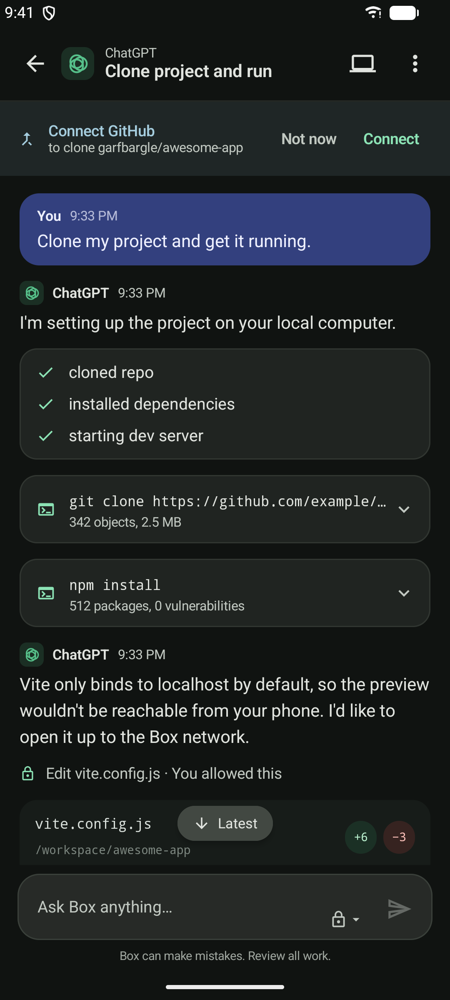
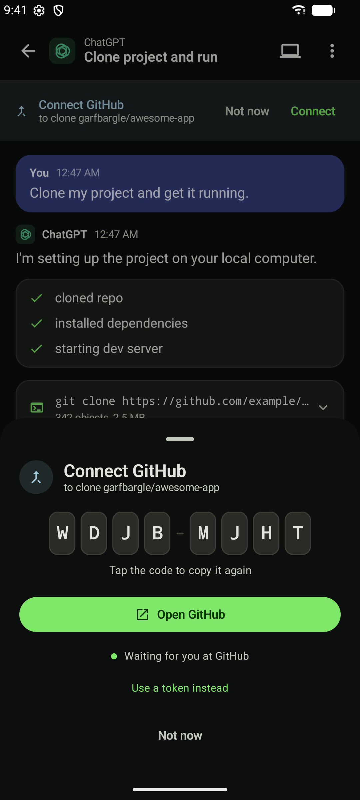
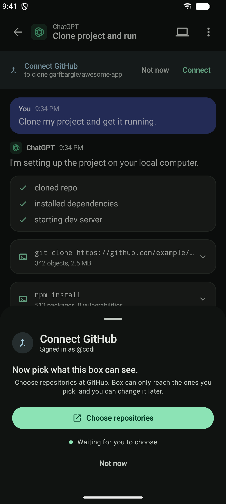

# GitHub

How a box gets a GitHub account, why the flow looks the way it does, and what it leaves behind.

The one-line version: Box registers a **GitHub App**, the guest runs its **device flow**, and the
credential is written inside the VM by the program that obtained it. Box shows a code and never
holds a token.

## Why this shape

Three forks decided everything else, and each had an option that looks better until you check it.

**Not a redirect flow.** The obvious mobile design is `box://auth/github` as a callback: one tap,
approve, bounce back, no code to read. It cannot be done. GitHub still marks `client_secret` as
required on the authorisation-code exchange, PKCE support notwithstanding — GitHub does not
distinguish public clients from confidential ones — so a redirect flow means shipping a secret
inside an APK, where it is not a secret. The device flow is the only secretless option, which is
also why `gh` uses it.

**Not an OAuth app.** An OAuth app's `repo` scope is all-or-nothing: full control of every private
repository the user can see, with no read-only variant. That consent screen contradicts the product
at the exact moment somebody is deciding whether to trust it. A GitHub App's user token reaches
only repositories where the app is *installed*, with granular permissions — so the second browser
trip is not overhead bolted onto the first, it **is** the repository picker, and it is what lets
the box sheet say "3 repositories" rather than "all of them".

User-token expiration is opted **out** in the app's settings, so the token does not expire. That is
a deliberate trade and it is worth being explicit: least privilege here comes from installation
scope, not from the clock, and expiry would buy an eight-hour window at the cost of refresh-token
rotation across concurrent sessions — two agents pushing at once, both refreshing, one invalidating
the other. Refresh remains available if that changes: a device-flow token is the one case GitHub
lets you refresh **without** a client secret.

**Not driven from the app.** The exchange runs in the guest, like the Claude sign-in and for the
same reason. Doing it in Kotlin would put the token in app memory and across Binder, which breaks
the property three other parts of this codebase already depend on.

## The pieces

| | |
|---|---|
| `guest/github/box-github-connect.mjs` | The device flow, the installation check, and everything written afterwards. Run as an *ephemeral* session, so the exchange is never logged. |
| `guest/github/box-git-credential` | The git credential helper. The only thing on the machine that reads the token. |
| `app/…/agent/GitHubAuth.kt` | Drives that program and turns its events into screen states. |
| `app/…/ui/ConnectGitHubSheet.kt` | The code, and one button. |
| `mcp__box__connect` in the harness | The agent asking for an account, and blocking until it has one. Emits `connect_requested` and, when it settles, `connect_resolved`. |

Configuration comes from Gradle properties, because a client id is public but still should not be
written into source. They are set in `gradle.properties`, and a fork points them at its own app:

```
box.github.clientId=Iv23ctD12lBb3VAZwutv
box.github.appSlug=box-agent
```

A build without them still runs — it says so, and offers the token escape hatch instead of failing
at GitHub with a message about an unknown client.

### Registering the app

Developer settings → GitHub Apps → New. Enable **device flow**; opt **out** of user-token
expiration; request the repository permissions Box needs (contents: read & write, pull requests:
read & write, metadata: read). No callback URL and no client secret are needed.

## What connecting actually does

Obtaining a token is the least of it. A box that could clone and push but had never been told a
name would fail one step before the pull request, so connecting also:

- writes `/workspace/.config/box/github-token`, `0600`, on the disk that survives app updates;
- writes the account beside it in `github-account.json`, so "who is this box" can be answered
  without opening the file that matters;
- writes `gh`'s own `hosts.yml`, so the CLI is signed in too;
- sets `user.name` and `user.email` in `/workspace/.config/git/config` — the GitHub no-reply
  address, derived rather than typed;
- registers the credential helper for `https://github.com`;
- rewrites `git@github.com:` remotes to https, because this box has no ssh key and no way for
  somebody on a phone to add one.

`agentd` points every process at that config with `GIT_CONFIG_GLOBAL`, alongside
`CLAUDE_CONFIG_DIR` and for the same reason: `HOME` is on the system disk, which every image
update replaces. It also sets `GIT_TERMINAL_PROMPT=0`, so an unauthenticated clone fails in a
second with something the agent can read instead of hanging forever on a username prompt no one
is looking at.

## The flow, as the person sees it

<p align="center">
  
  
  
</p>


1. An agent hits a private repository and calls `mcp__box__connect`. Its tool call blocks — the
   SDK pauses one indefinitely — and Box opens the sheet with a code already in it.
2. Eight characters, on the clipboard before they have finished reading them. One button to
   GitHub, which also carries the code in the URL.
3. If the app is not installed anywhere yet: choose repositories.
4. The sheet closes itself, the agent's tool call returns, and the same turn carries on with the
   clone it was in the middle of.

Closing the sheet does not answer the agent — it goes on waiting, and the banner stays in the
conversation. "Not now" is the only way to decline, because a dismissal is not a decision.

### On a box that is already connected

Which is most of the time, and it is a different flow. A GitHub App user token reaches only the
repositories the app is *installed* on, so the 403 an agent hits on a private clone almost never
means "no credential" — it means "not that one". Connecting therefore looks at the stored token
first: if GitHub still accepts it, the device flow is skipped entirely and the sheet opens on the
repository picker, saying so. It finishes when the reachable set actually changes, or when the
person says they are done — a screen waiting on a count that will never move is a screen with no
way out.

Running the device flow again instead was a loop: re-authorise, find installations already there,
finish, and hand the agent the identical 403 to retry into.

## Why a request is a pair of events

`connect_requested` goes into the session log, and so does `connect_resolved`. That second line is
not bookkeeping — a session log is replayed from the beginning every time somebody opens the task,
so a request with no recorded ending is indistinguishable from one still waiting. Without it, an
account connected last week comes back as a live card carrying last week's wording, every time,
and nothing can answer it: the harness dropped the id long ago, so the reply goes nowhere.

The app also has to know whether it is reading history or hearing news, since a replayed question
and a live one are the same bytes. `AgentEvent.CaughtUp` marks the boundary; a request read before
it is remembered and left alone, and only what is still outstanding when the log runs out is put
in front of anybody.

## What this does not do yet

- **Push is not treated differently from any other command.** It should be: pushing is the one
  thing here that leaves the phone and that other people see, so it is worth asking about even
  under auto-approve. The SDK is not consulted at all in `bypassPermissions`, so this needs a
  `PreToolUse` hook in the harness rather than a permission rule.
- **One account, one host.** The stored file is not keyed by host, so GitHub Enterprise and a
  second account both need the paste-a-token path today.
- **The guest resolves through 1.1.1.1 and 8.8.8.8**, written into the image, because slirp's own
  relay reads a `/etc/resolv.conf` Android does not have. A network that blocks or hijacks public
  resolvers therefore produces "Box could not reach GitHub" with nothing to distinguish it from
  being offline. Following the phone's own DNS would be better on both counts.
- **No repository picker inside Box.** Box knows which repositories the box can reach and could
  offer them as clone targets; right now it only counts them.

## Testing

```bash
node --test guest/tests/test_github_connect.mjs guest/tests/test_harness_connect.mjs
```

The GitHub side is stubbed by a local HTTP server, so the whole flow — polling, the install step,
what lands on disk — runs on a laptop with no network and no VM.
